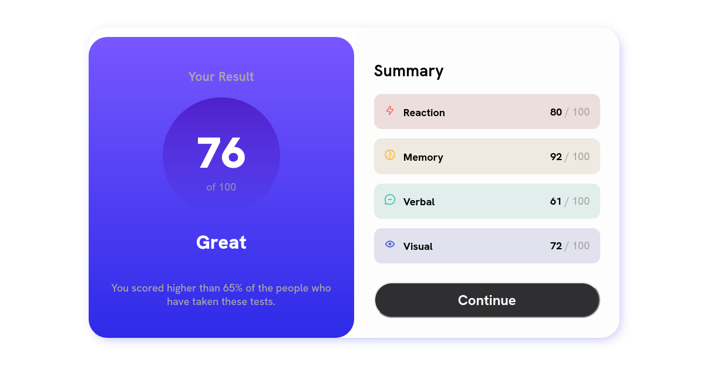
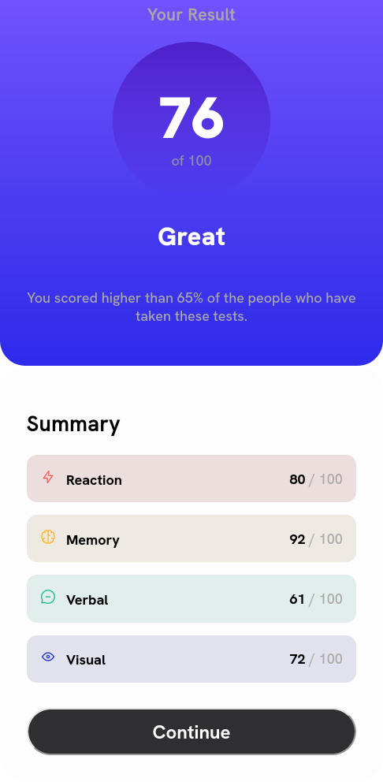

# Frontend Mentor - Results summary component solution

This is a solution to the [Results summary component challenge on Frontend Mentor](https://www.frontendmentor.io/challenges/results-summary-component-CE_K6s0maV).

## Table of contents

- [Overview](#overview)
  - [The challenge](#the-challenge)
  - [Screenshot](#screenshot)
  - [Links](#links)
- [My process](#my-process)
  - [Built with](#built-with)
  - [Continued development](#continued-development)
- [Author](#author)

**Note: Delete this note and update the table of contents based on what sections you keep.**

## Overview

### The challenge

Users should be able to:

- View the optimal layout for the interface depending on their device's screen size
- See hover and focus states for all interactive elements on the page

### Screenshot

### Links

- Solution URL: (https://your-solution-url.com)
- Live Site URL:(https://drzero1234.github.io/FEM_Result_Summary/)

## My process

### Built with

- Semantic HTML5 markup
- CSS custom properties
- Flexbox

### Continued development

- Just grasping the idea of mobile first development so there I definitely need to work on that
- Flexbox or CSS grid advanced workflow
- Custom font & colors

## Author

- Frontend Mentor - [@DrZero1234](https://www.frontendmentor.io/profile/DrZero1234)
- GitHub - [@DrZero1234](https://github.com/DrZero1234)

